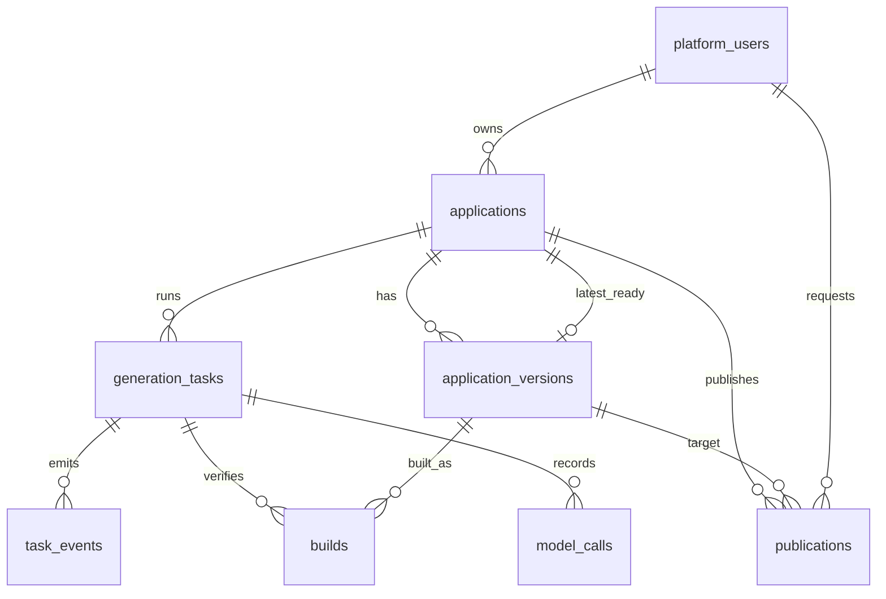

# D02-A data model

`builds` records real runner results and `model_calls` records model usage separately.
`publication` is the deployment request/result. A version has a unique number within
an application and a fixed source digest. Its status can move from DRAFT to VERIFIED
only with a successful build; a finalized version cannot change status. The database
rejects publication of an unverified version or a request by a different owner.

## Migration and environment

- Spring Boot 4.1.1 runs Flyway `V1__platform_data.sql` before application access.
- Runtime configuration requires `CODELESS_DATABASE_URL` (JDBC URL),
  `CODELESS_DATABASE_USER`, and `CODELESS_DATABASE_PASSWORD`. Missing configuration
  prevents startup. No credentials are checked in.
- Integration tests use the `test` profile and Testcontainers 2.0.5 with a PostgreSQL 17.6 Alpine
  image pinned to `sha256:ef257d85f76e48da1c64832459b59fcaba1a4dac97bf5d7450c77753542eee94`.
  Testcontainers cleanup uses Ryuk 0.14.0 pinned to
  `sha256:7c1a8a9a47c780ed0f983770a662f80deb115d95cce3e2daa3d12115b8cd28f0`.
  Testcontainers supplies a fresh random host port, test-only user and database. The
  production URL is set to an unreachable sentinel during tests to prove separation.
- Run `corepack pnpm verify:api` with Java 21 and a running Docker engine. The test
  suite checks migration idempotence, unique/foreign keys, immutable version data,
  transaction rollback, and environment isolation against PostgreSQL itself.

## Transaction boundary

`TaskProgressService.transition` locks a task, checks its allowed transition, updates
status and event sequence, and appends the corresponding event under `@Transactional`.
`PlatformRepository.createTask` also creates the initial PLAN event in one transaction.
The event has a unique `(task_id, sequence)` key. A database error on the event therefore
rolls back every change to the task. `READY` requires a verified version with its
successful build attached to the same task and application. There is no path for a
model response to assert READY on its own.
